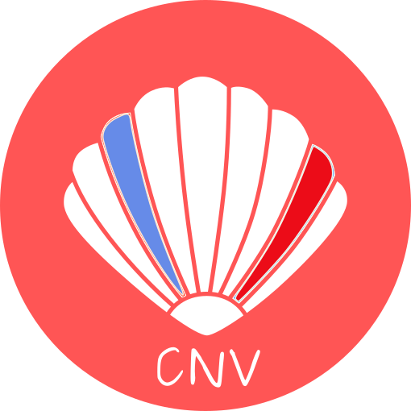
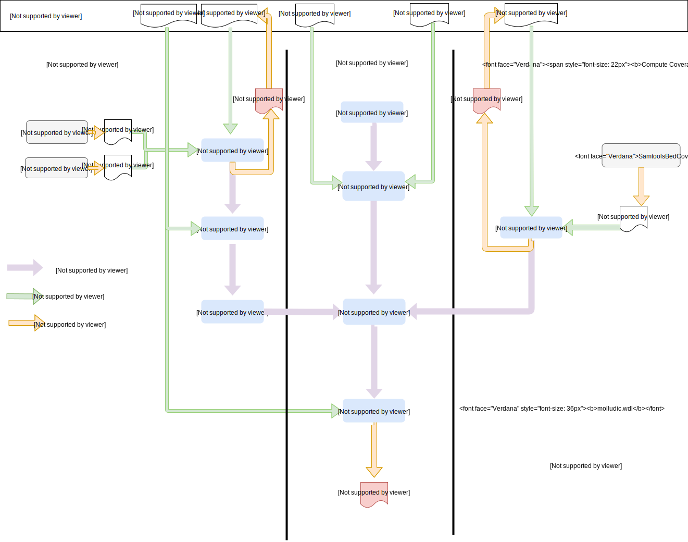

# MoLLuDIC
- [MoLLuDiC - a CNV Exome pipeline adapted from clamms ](#MoLLuDiC)
	- [Overview](#overview)
		- [Citing MoLLuDiC](#citing-molludic)
		- [Input](#input)
		- [Output](#output)
	- [Installation](#installation)
		- [Requirements](#requirements)
	- [Quick start](#quick-start)

--------------------------------------------------------------------------------


The **MoBiDiC capture CNV** calling, annotation and interpretation tools based on clamms workflow [https://github.com/rgcgithub/clamms](https://github.com/rgcgithub/clamms). 

This workflow is easily accessible with a Singularity image, low memory usage, handle batch effects and annotate with useful databases for human diagnostics.

# Overview

NV calling on NGS Capture library technologies are difficult to implement in bioinformatics pipeline and their performance are doubtful due to capture bias. 
Moreover, since there is no standard for CNV caller output, CNV are difficult to annotate. 

We propose an **exportable WDL workflow** based on open source tools and open source MoBiDiC script for CNV calling, annotation and interpretation interface. Performance of MoLLuDIC are increasing with data collection enlargement. 

- MoLLuDiC can be easily installed with a **singularity** container.
- MoLLuDiC is powered by **WDL** and **Cromwell** from Broad Institute. This pipeline are adaptable and easy-to-use via JSON input file .
- CNV calling and removing batch effects are based on **clamms** [https://github.com/rgcgithub/clamms](https://github.com/rgcgithub/clamms).
- CNV **familial segregation** is made with bedtools. 
- CNV annotation is based on **bedtools and MoBiDiC-made master annotation file**.
- CNV call could be interpreted in TSV viewer and SNV/CNV common interpretation could be realized via **Captain ACHAB** https://github.com/mobidic/Captain-ACHAB.

## Main workflow



- Select mode : "from scratch" to process all your data or "routine" to process new samples
- Select a library : capture from panel to whole exome sequencing
- Remove batch effect : Selection of a cluster of X most identical sample within 7 technical parameters (SEX, AT and GC Dropout, Mean Insert Size, Percentage of targeted base covered with 10X and 50X...) via a statistical method named k-d Tree.
The X number of sample is scalable depending on your data (KNN).  
- Remove relatives from CNV calling : add a family list file (tabulated file with sample identifier) remove relative from calling
- CNV calling : Read Depth Coverage statistical analysis
- CNV familial segregation : bedtools intersect and merge with all CNV call from relatives
- CNV annotation : bedtools intersect with a master annotation file containing cytoband, OMIM, ExAc CNV population frequency and metrics, in silico predictions tools. Instructions for master annotation file creation are described below. 


## Citing MoLLuDiC

> MoLLuDiC : Exportable CNV calling, annotating and interpretating workflow for NGS Capture sequencing (2019).  https://github.com/mobidic/MoLLuDiC

## Input

- Library bed file
- Metrics from Picard Tools (CollectHsMetrics and InsertSizeMetrics)
- Coverage from samtools bedcov or GATK DepthOfCoverage

## Output

- An annotated CNV calling bed file (with or without familial segregation)

# Installation

To download MoLLuDiC, please use git to download the most recent development tree.
Currently, the tree is hosted on github, and can be obtained via:

```bash
$ git clone https://github.com/mobidic/MoLLuDiC.git
```
## Create Singularity Image
**  First, build**
```bash
singularity build <filename.simg> Singulairity 
```
**Then run**
```bash
singularity run <filename.simg> -i workflow_inputs.json
```
**Singularity help**
```bash
singularity help <filename.simg>
```
## Requirements 

- Linux OS
- Cromwell
- C
- git
- python 3
- bedtools (v2.27.1)
- R software and the FNN package install.packages("FNN")
- Singularity


# Quick start

## From Scratch workflow

```bash
singularity run  <filename.simg> -i workflow_inputs.json```
```

## NGS routine workflow

```bash
singularity run <filename.simg> -i workflow_inputs.json
```
# Troubleshooting

## Using GATK

GATK needs that bed file contains "chr" before chromosome number. Clamms needs no chr before chromosome number. Be careful with your bed data ! 

```bash
sed 's/^chr//g' yourbedwithchr > bedforclamms.bed"
sed 's/^/chr/g' yourbedwithoutchr.bed > bedforgatk.bed"
```

## For panel capture

Creation of windowsBed need that your capture library.bed got the same chromosome that in the hg19.fa genome.
To create a specific hg19.fa genome without selected chromosome, please find a shell script that should work (example here with chromosome 13, 21 and 22 removed).

```bash
sed '/chr13/,/chr14/{//!d}' /usr/local/share/refData/genome/hg19/hg19.fa | grep -v "chr13" |  sed '/chr21/,/chr22/{//!d}' |  sed '/chr22/,/chrX/{//!d}' | grep -v "chr21" | grep -v "chr22" | sed 's/chr//g' > hg19_moins132122_nochr.fa

```
--------------------------------------------------------------------------------

**Montpellier Bioinformatique pour le Diagnostique Clinique (MoBiDiC)**

*CHU de Montpellier*

France


[Visit our website](https://neuro-2.iurc.montp.inserm.fr/mobidic/)

--------------------------------------------------------------------------------
